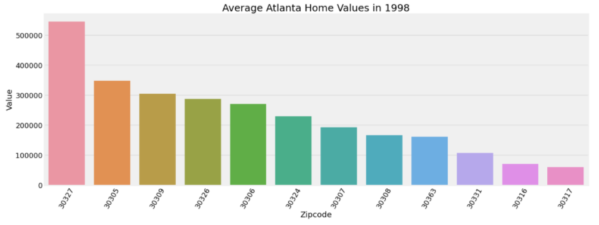
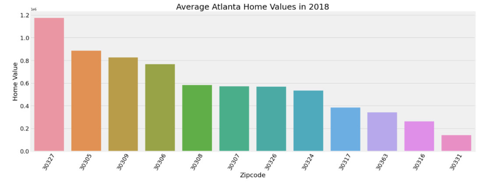
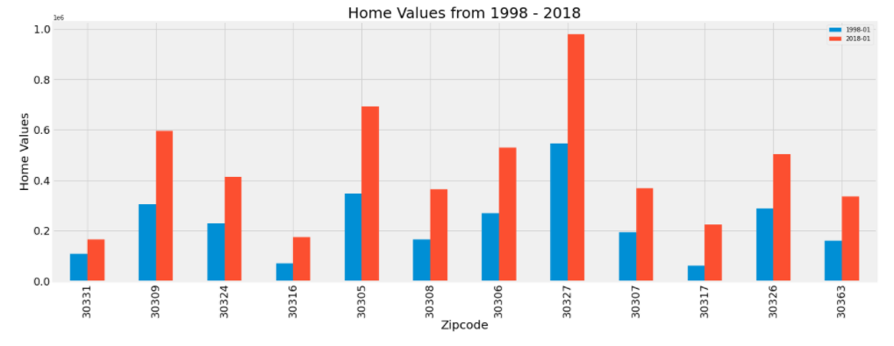
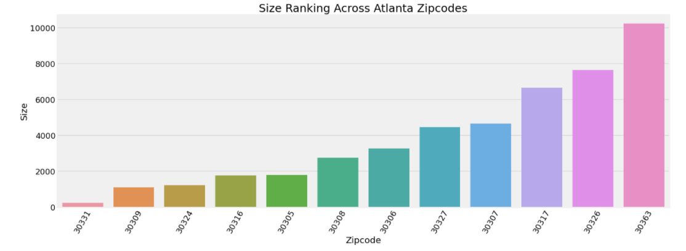
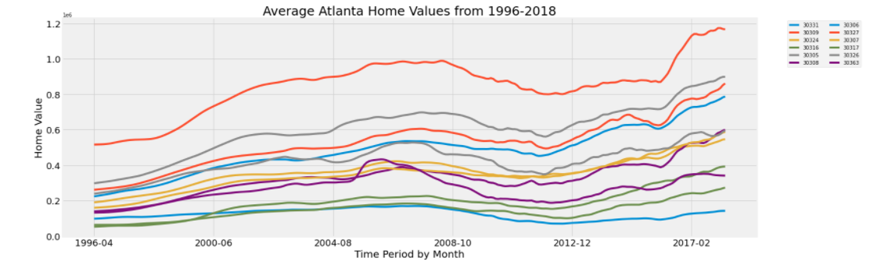
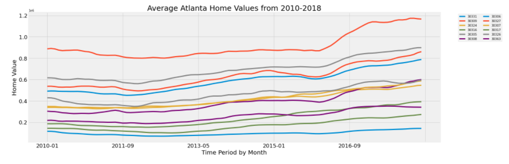

# Atlanta Zipcode Analysis Project

**Author**: Sierra Stanton

## Overview


This project analyses real estate data from Zillow Research to determine which areas are prime for investment. We have been charged with helping Hellbent Investments narrow down the zipcodes that they should target as they plan for this next round of outspend. We'll use Zillow's dataset to dive into home values in Atlanta across time, and narrow down five zipcodes worthy of investment according to project ROI.

## Business Problem

We' be forecasting real estate prices of various zip codes using data from [Zillow Research](https://www.zillow.com/research/data/). For this project, we'll will be acting as a consultant for Hellbent Investments, a real-estate investment firm focused on development in Atlanta, GA.

Hellbent Investments has asked me what seems like a simple question:

> What are the top 5 best zip codes for us to invest in?

In order to provide a solid recommendation, we met with the firm and determined that projected ROI across the next three years is the best way to narrow down the zipcodes they'll want to focus on.

First, we'll investigate home value data across time within Atlanta's zipcodes. Second, we'll investigate the zipcodes themselves to gauge potential contributing factors. Third, we'll use time series forecasting via ARIMA and Facebook Prophet to chart out future home values and narrow down our list of zipcodes to just five targets.

## Data

Data will be used from the following source:
* __[Zillow Research](https://www.zillow.com/research/)__ - this sector of Zillow aims to be the most open, authoritative source for timely and accurate housing data and unbiased insight.

Zillow Research's Zillow Data (`zillow_data.csv`): this dataset shows us the average housing sales prices in the United States based on location while shedding light on other location-focused aspects through rankings such as population density. This set shows us information on over 14,000 zip codes - let's explore it further.

## Methods & Results

I use descriptive analysis and time-series modeling to show:
* How the home values across Atlanta zipcodes ranged over twenty-two years
* The population density across Atlanta zipcodes
* The effect of the 08' housing crisis and how we narrowed data appropriately to downvalue this trend

Due to the datasets used and their current nature, I'm confident these findings will prove relevant as Hellbent Investments begins their next real-estate outspend. There are many more ways we can deepen our analysis to prove even more insightful with more time and access to additional data.

### Atlanta Home Values in 1998


### Atlanta Home Values in 2018


### Atlanta Home Values from 1998 - 2018


### Population Density Across Atlanta Zip Codes


### Atlanta Home Values from 1996 - 2018


### Atlanta Home Values from 2010 - 2018


## Conclusions

In development.

## Next Steps

This goes beyond our initial time-series analysis and is worth further exploration.

* **In development.** In development.

## For More Information

Please review my full analysis in my [Jupyter notebooks](./notebooks) or [presentation](./Film_Analysis_Project.pdf).

For any additional questions, please contact **Sierra Stanton** & stanton.sierraerin@gmail.com

## Repository Structure

```
├── README.md
├── notebooks
├── data
├── presentation
├── images
└── Atlanta_Zipcode_Analysis_Project.pdf
```
